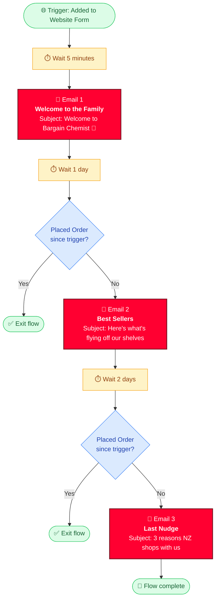

# Welcome Series — Visual Flow Diagram
*Bargain Chemist • Klaviyo flow `SehWRt` • No-coupon strategy*

---

## Recommended structure

---

## Timeline view

```mermaid
gantt
    title Welcome Series — 3 emails over 3 days
    dateFormat HH
    axisFormat Day %d
    section Customer journey
    Signs up via website form        :milestone, m1, 00, 0h
    Email 1 — Welcome                :crit, e1, 00, 1h
    Email 2 — Best Sellers           :crit, after e1, 24h
    Email 3 — Last Nudge             :crit, after e2, 48h
```

---

## Step-by-step in Klaviyo (after deleting the 3 conditional splits)

| Step | Action type | Configuration |
|------|-------------|---------------|
| 1 | Trigger | Added to Website Form (existing — keep) |
| 2 | Time Delay | **5 minutes** (or set to 0 for immediate) |
| 3 | Send Email | Template: `BC — Welcome Email 1 — Welcome to the Family` Subject: `Welcome to Bargain Chemist, {{ first_name\|default:'there' }} 👋` From: `hello@bargainchemist.co.nz` |
| 4 | Time Delay | **1 day** |
| 5 | Conditional Split | "Placed Order at least once since starting this flow" YES → Exit • NO → continue |
| 6 | Send Email | Template: `BC — Welcome Email 2 — Best Sellers` Subject: `{{ first_name\|default:'There' }}, here's what's flying off our shelves` |
| 7 | Time Delay | **2 days** |
| 8 | Conditional Split | "Placed Order at least once since starting this flow" YES → Exit • NO → continue |
| 9 | Send Email | Template: `BC — Welcome Email 3 — Last Nudge` Subject: `{{ first_name\|default:'Still here' }} — 3 reasons NZ shops at Bargain Chemist` |

---

## How to view this diagram as a real picture

- **GitHub** — open this file on github.com → mermaid renders automatically
- **VS Code** — install the "Markdown Preview Mermaid Support" extension → Cmd/Ctrl+Shift+V on this file
- **Notion** — paste the mermaid block into a new "code" block and set language to `mermaid`
- **Online** — copy the mermaid code block and paste at https://mermaid.live for an instant preview

For a true rendered image, also see the companion HTML mockup at `welcome-flow-diagram.html` in this folder — just double-click to open in any browser.
