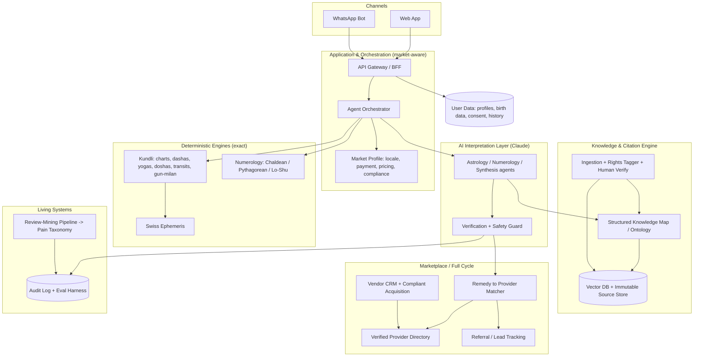

# Darpan AI — Architecture & Build Blueprint (v2)

> **Working title only — "Darpan" (दर्पण, "mirror"). Rename freely.**
>
> A trust-first spiritual-guidance platform for the Indian diaspora, expanding to India.
> Deterministic Vedic-astrology + numerology engines, an AI interpretation layer that
> **only speaks from sourced, citable knowledge**, and a vetted-provider marketplace that
> closes the loop — built specifically to fix the documented pain points that erode trust
> in today's astrology apps.
>
> **Every factual claim in this document is tagged:** `✅` = verified against a cited source
> (see §16); `⚖️` = engineering/strategy judgment; `🛠️` = operational commitment (won by
> discipline, not code). This satisfies the project's golden rule: nothing stated as fact
> without a source.

---

## 1. Guiding principles (the spine)

1. **Deterministic engines + citation-enforced AI.** The math (charts, dashas, numerology)
   is exact and reproducible. Interpretation is *only* ever composed from retrieved,
   cited sources — the model is structurally forbidden from making any interpretive claim
   it cannot attribute to a document we control. ⚖️
2. **We guarantee provenance, not truth.** We can be ~100% sure that every statement
   traces to a real source, the citation supports it, and nothing was invented. We make
   **no** claim that the astrology itself is empirically true. ⚖️
3. **Trust is the product.** The market is full of documented fear-selling, fake
   practitioners, meter manipulation, and billing traps (§8, §16). Our entire
   differentiation is being the honest, transparent, incentive-aligned alternative. ⚖️
4. **Incentive alignment beats features.** We monetize so our interests match the user's
   (AI-first, flat/transparent pricing, honest cited remedies) — which incumbents *can't*
   copy without destroying their core revenue. ⚖️
5. **Structural before operational.** Where a guarantee can be enforced by architecture
   (`[S]`), enforce it there. What can't (`[O]`) is won by operational integrity, and must
   be treated as an ongoing discipline, not a one-time feature.

### What we can and cannot guarantee
| ✅ Achievable (~100%) | ❌ Not achievable |
|---|---|
| Provenance — every claim traces to a real stored source | That the astrological claim is empirically true |
| Faithfulness — the citation genuinely supports the claim | That two astrologers would agree on the chart |
| Reproducibility — same chart + same sources → same reading | A "fully automatic, no-human" knowledge base that is also certain (see §5.2) |
| Chart/math correctness (it's astronomy + arithmetic) | — |

---

## 2. System overview



**The user loop:** birth data → **exact** charts (engines) → **cited** interpretation +
"what it means" (AI) → honest, cited **remedies** → hand-off to a **vetted provider** →
referral tracked. Every step logged and auditable.

---

## 3. Core component 1 — Deterministic calculation engines

Pure, testable, reproducible code; zero AI. This is where "no mistakes" is literally true.

### Kundli (Vedic / Jyotish)
- **Ephemeris:** Swiss Ephemeris (`pyswisseph`) — arc-second accuracy, NASA-JPL-derived.
  **Licensing decision required:** it is **dual-licensed AGPL or commercial**; AGPL forces
  open-sourcing the whole networked app, so a proprietary SaaS needs the **commercial
  license (CHF 750 first + CHF 400 per additional)**. ✅
- **Zodiac:** sidereal; default **Lahiri / Chitrapaksha ayanamsa** — India's official
  standard, adopted **1956** by the Calendar Reform Committee (chaired by physicist
  Meghnad Saha; N.C. Lahiri, secretary). Support Raman & KP as options. ✅
- **Inputs:** DOB, **exact birth time** (Lagna shifts ~every 2 min), place → lat/long +
  **historical timezone/DST** resolution (a notorious bug source).
- **Outputs:** 9 grahas (Navagraha incl. Rahu/Ketu), Lagna + houses (whole-sign), 27
  **Nakshatras** + padas ✅, **Vargas** (D1/D9/D10 for MVP), **Vimshottari Dasha** tree
  (from Moon's nakshatra ✅), **Yogas/Doshas** (Mangal, Kaal Sarpa, Sade Sati), **transits
  (Gochar)** real-time, and **Gun Milan / Ashtakoota** = the **36-point** marriage match
  (8 kootas; Nadi weighted highest). ✅
- **Reference libs to study:** Swiss Ephemeris, VedAstro, `jyotisha`. ✅

### Numerology
- Exact arithmetic. **Chaldean** (popular in India) + Pythagorean + **Lo Shu grid**;
  Psychic/Driver, Destiny/Life-Path, Name numbers, missing/repeating numbers.

**Architectural rule:** the AI **never** computes astrology — it only interprets the
engines' structured output. (LLMs do arithmetic badly and would hallucinate positions.) `[S]`

---

## 4. Core component 2 — Knowledge & Citation Engine (the heart)

A RAG system with **rights-tracking, provenance, and a structured retrieval layer**.

### 4.1 Source tiers (legal safety baked in)
| Tier | Examples | Rule |
|---|---|---|
| **T1 Public domain** | BPHS, Saravali, Phaladeepika, Lal Kitab, classical numerology/palmistry | Ingest fully, cite freely. Bedrock. |
| **T2 Licensed** | Modern authors/publishers under signed deals | Ingest only after license; cite by author; respect quote limits. |
| **T3 Open web** | Reputable, attributable articles | **Supplementary only**, never sole authority. |
| **T4 Expert-authored** | Original content from hired, credentialed astrologers | Ours; cite the named expert. Fills gaps the classics don't cover. |

> **Hard guardrail:** ingestion refuses any document lacking a rights tag + provenance.
> The AI quotes only within what each tag permits. This is how "use all sources" stays legal. `[S]`

### 4.2 Provenance & integrity (how the DB is "sure")
- **Store verbatim source, never paraphrase.** Each passage gets a stable **citation
  handle** (`BPHS:7:12`) + a **hash of the source file** so stored text is provably the
  source's. `[S]`
- **Metadata per chunk:** title, author, **translation/edition**, page/verse, rights tier,
  who digitized, who verified, date. No metadata → rejected. `[S]`
- **Human-verified ingestion — the honest trade-off:** classical texts are OCR'd from
  scans of translations; OCR errors are rampant, so a qualified human confirms each
  passage. **This means ingestion is not 100% automatic.** You can have "auto-updated" OR
  "100% sure" at this gate, not both — we put verification on the critical path. 🛠️

### 4.3 Structured Knowledge Map (the hard part, now explicit)
Plain vector search is **not** enough to be *sure the right source is retrieved* — RAG
retrieves the right document and still generates wrong answers `✅` (§16). So we build an
**expert-curated ontology**: `chart-feature → canonical concept → source passages`
(e.g. "Mars in 7th / Manglik" → the specific verses across texts). Retrieval becomes
auditable and largely deterministic, not a similarity guess. Vector search is the fallback,
not the primary path. `[S]` ⚖️

### 4.4 Tech
pgvector (single Postgres early; dedicated vector store at scale) + embeddings + reranker;
immutable, versioned source store.

---

## 5. Core component 3 — AI Interpretation Layer (how we use Claude)

Multi-agent, orchestrated with the **Claude Agent SDK**. Claude reasons; engines + KB are tools.

### 5.1 Agents
- **Orchestrator** — routes the user's question + charts to specialists.
- **Astrology / Numerology agents** — interpret; retrieve + cite from the KB.
- **Synthesis & Remedy agent** — reconciles disciplines, proposes cited remedies, flags
  contradictions honestly.
- **Verification + Safety Guard** — enforces no-uncited-claim + safety/positioning policy.

### 5.2 The traceable claim object (citation + meaning are the unit of generation)
The AI emits **structured claims**, then prose is *rendered from them* — it cannot produce
a "naked" sentence because the schema has no field for one. `[S]`

```
Claim {
  chart_fact:     "Mars in 7th house (D1), Manglik"   // from engine, has an ID
  source_refs:    ["BPHS:7:12 (Sharma trans., 1998)"] // must resolve to a REAL passage
  verbatim_quote: "...exact stored text..."
  meaning:        "Plain-language: traditionally read as friction in early marriage..."
  type:           sourced | synthesis | personalization
  confidence:     high | medium | low
  caveats:        "KP tradition reads this differently"
}
```

**Generation pipeline:**
1. Engine → structured chart facts (IDs).
2. Retrieve passages via the Knowledge Map (+ vector fallback).
3. Generate claim objects — `source_refs`, `verbatim_quote`, **and** `meaning` mandatory.
4. **Resolve & validate citations** — every ref looked up; quote must **byte-match** the
   store. *(Defeats fabricated citations — LLMs fabricate references at 14–95% rates `✅`.)* `[S]`
5. **Entailment check** — separate pass confirms `meaning` *follows from* `verbatim_quote`. `[S]`
6. Synthesis agent renders narrative as a *view* of claim objects; every UI sentence links
   back to source + meaning.

### 5.3 Claude features
Tool use (engines/KB as tools); structured JSON outputs; **prompt caching** for the large
stable system/knowledge prompts; **model tiering** (Opus for deep paid reports;
Sonnet/Haiku for routing/chat); an **eval harness** of reference charts + expected cited
claims, reviewed by experts.

### 5.4 Safeguards (full set)
| Safeguard | Purpose | Type |
|---|---|---|
| Citation resolution + byte-match | No fabricated/wrong citations | `[S]` |
| Entailment verifier | Claim must be supported, not just adjacent | `[S]` |
| **Refuse-rather-than-guess** | No coverage → "no sourced guidance," never invent | `[S]` |
| `synthesis`/`personalization` labels | Mark inferences & personal application vs sourced tradition | `[S]` |
| Synthesis depth cap | Stop the AI over-extrapolating beyond sources | `[S]` |
| **Red-line classifier** | Health/finance/legal/self-harm → disclaimer + human referral, never directive | `[S]` |
| Tone/emotional-safety guard | No fear-mongering, bullying, catastrophic warnings | `[S]` |
| **Always disclose AI vs human** | Transparency; no covert AI | `[S]` |
| Prompt-injection isolation | Treat user text as untrusted | `[S]` |
| Conflict surfacing | Show disagreeing sources, don't pick silently | `[S]` |
| Translation provenance | Cite translator/edition, not just the text | `[S]` |
| Absence via engine only | "No dosha" comes from deterministic check, not prose | `[S]` |
| Immutable audit log | Reconstruct any answer (chunks + handles + model version) | `[S]` |
| Sampled human audit | Experts review live outputs → corrections become T4 | `🛠️` |
| Unsupported-claim-rate metric | Production alert if guardrails slip | `[S]` |

---

## 6. Core component 4 — Marketplace / "full cycle"

Model: **verified directory + referral first** (booking/payments later).

- **Verified-credential-only directory** — ID + qualification vetting as a public promise
  (directly attacks the "most astrologers are fake" complaint `✅`). Profiles show
  specialities, languages, region, ratings. 🛠️
- **Remedy → provider matcher** — cited remedies route to the right vetted provider by
  speciality/language/region.
- **Integrity remedies** — cited, optional, transparently priced, only when the chart
  supports them; **no fear-selling, no kickback-driven gemstone pushes**, harmful remedies
  banned (industry's most-criticized practice `✅`). 🛠️ + `[S]` (Guard policy)
- **Referral/lead tracking** for revenue + provider reporting.
- **Vendor acquisition** — compliant cold-email (3-months-free, no-commission). Cold email
  is **regulated, not banned**, and varies by country: **US CAN-SPAM = opt-out** (first
  email legal with sender info + unsubscribe), **CASL = consent**, **GDPR = lawful basis**,
  **UK PECR = B2B carve-out** `✅`. Build per-country handling + suppression/consent logs. 🛠️
- **Supply doubles as the India play** — India-recruited astrologers serve high-ARPU NRIs now.

---

## 7. Living systems — Review-mining pipeline

A scheduled pipeline ingests reviews (Trustpilot, MouthShut, PissedConsumer, app stores,
Reddit), classifies them into the **pain taxonomy** (§8), and tracks frequency over time —
keeping the pain database current, flagging emerging issues (incl. our own), and feeding the
roadmap. *(The existing `pantrypilot` repo already has scheduled-scraper plumbing to adapt.)* 🛠️

---

## 8. Differentiation by pain point (evidence-based)

Derived from reviews across AstroTalk, AstroSage, Astroyogi, InstaAstro, GaneshaSpeaks,
Co-Star, The Pattern, Nebula, Hint, Astroline `✅`. **Key insight:** ~⅓ of complaints are
*technology* problems we solve structurally `[S]`; ~⅔ are *business-model/integrity*
problems we solve by **incentive alignment** `🛠️` — which incumbents can't copy without
breaking their revenue (the innovator's dilemma moat).

| Documented pain | Our answer | |
|---|---|---|
| Fake/unqualified astrologers | Verified-credential-only marketplace | `🛠️` |
| Same Q → different answer; bad chart math | Deterministic engines = exact + reproducible | `[S]` |
| Vague "applies-to-anyone" readings | Claim tied to chart fact + cited source + "why"; generic blocked | `[S]` |
| Fear-mongering & scare tactics | Tone guard: describe, don't catastrophize | `[S]` |
| Exploitative gemstone/puja upsell | Integrity remedies: cited, optional, transparent | `[S]+🛠️` |
| Per-minute meter anxiety / markups | AI-first → flat transparent pricing, no meter | `[S]` |
| Hidden charges / price jumps / +50% intl | All-in pricing, forex shown, fair NRI pricing | `🛠️` |
| Sub traps: charged after cancel, hard to cancel | One-tap cancel, pre-renewal reminders | `🛠️` |
| Refund refusal / wallet-only / pathetic CS | Real refunds + ticketed grievance redressal | `🛠️` |
| Data → profiling → targeted upsell | Privacy-by-design, no manipulative profiling | `[S]+🛠️` |
| Bullying/harmful notifications | Emotional-safety guard + red-line classifier | `[S]` |
| Covert AI | Always disclose AI vs human | `[S]` |
| NRI: timezone / trust / payment / language | TZ-aware + async cited reports; vetted native-language providers; localized rails | `[S]+🛠️` |

---

## 9. Two-market strategy — NRI-first → India

**Sequence: win NRIs first, then India. One platform core, per-market layers.**

- **Why NRI-first:** diaspora ~**35.4M** (≈15.85M NRIs + 19.57M PIOs) `✅`; **UAE & US
  ~17% of emigrants each** `✅`; **~$120B remittances (2023)** `✅`; NRIs **pay ~30% more**
  `✅`; underserved by India-optimized incumbents; and they're the bridge to India supply.
- **Beachhead markets:** lead **US** (ARPU, subscriptions) + **UAE/Gulf** (density); fast-
  follow UK/Canada/Australia/Singapore. ⚖️
- **Killer NRI wedge:** **marriage / Gun Milan matching** — NRI families pay premium and
  already expect astrological matching `✅`; partner with NRI matrimony verticals (B2B2C). ⚖️
- **Product shape differs by market:**
  - **NRI = AI-first + cited reports + subscription** (fits the original design — less
    rework); human consults are the premium/connection layer.
  - **India = human-consultation-primary, per-minute, deep-vernacular** (the inversion) —
    that's where ~80% of incumbent revenue sits `✅`. Comes in Phase 3+.
- **Architecture:** **market-agnostic shared core** (engines, KB, AI, marketplace, payments
  abstraction) + **thin per-market config layers** (language pack, payment rail
  Stripe↔Razorpay/UPI, pricing model, channel mix, compliance profile). Adding India = a
  config flip, not a rebuild. ⚖️
- **Synergy:** NRI demand (margin) funds + attracts India supply (volume). Solves the
  marketplace cold-start.

---

## 10. Competitive moat

The incumbent (**AstroTalk**: ~₹1,210 Cr FY25 revenue, ~30M users, ~40% share, targeting a
$1.3–1.5B IPO valuation `✅`) grows on per-minute + upsell — the very practices generating
fraud exposés and calls for regulation `✅`. **Don't fight them head-on.** Win on:
1. **Trust/transparency brand** (the unoccupied position). ⚖️
2. **AI-first economics** they can't match without cannibalizing per-minute revenue. ⚖️
3. **Verified supply** + AI-empowered astrologers. 🛠️
4. **NRI beachhead** (uncontested, higher ARPU). ⚖️
5. **Regulatory tailwind** — advocates demand transparent pricing, verified credentials,
   grievance redressal `✅`; be compliant-by-design before it's mandatory. ⚖️

**Honest risks:** trust compounds slowly; some users want comfort not transparency
(validate willingness-to-pay cheaply); pure AI won't satisfy the emotional/ritual need
(hence the human layer); don't fight a capital war; cold-start is real.

---

## 11. Data model (key entities)
User · BirthProfile (multi-person) · ChartComputation (immutable, engine-versioned) ·
Claim (chart_fact, source_refs, verbatim_quote, meaning, type, confidence) ·
Source/Chunk (text, rights_tier, provenance, handle, hash, embedding) · KnowledgeMap edges ·
Remedy · Provider (verification status) · Referral/Lead · VendorOutreach (consent/opt-out) ·
ReviewItem (mined, pain-tagged) · AuditRecord · Consent.

## 12. Tech stack ⚖️
Python calc microservice (pyswisseph) · TS/Node BFF · Claude Agent SDK · Postgres+pgvector ·
Next.js web · WhatsApp Business Cloud API · Stripe (global) + Razorpay/UPI (India) ·
modular monolith with clean boundaries (not premature microservices).

## 13. Compliance / ethics / legal
- **Positioning:** spiritual guidance + **clear disclaimers**; not medical/financial/legal
  advice; serious matters → qualified professionals (enforced by red-line classifier). `[S]`
- **Privacy:** birth data is sensitive. **India DPDP Act** — enacted 2023, consent must be
  "free, specific, informed, unambiguous," easy withdrawal; **full compliance deadline 13
  May 2027** (phased) `✅`. Plus GDPR/UK, CCPA for NRI markets. Privacy-by-design from day 1.
- **Advertising:** India **ASCI** — no "guaranteed prediction" claims.
- **Cold email:** per-country (CAN-SPAM/CASL/GDPR/PECR) `✅`; opt-out + consent logs.
- **Swiss Ephemeris:** choose AGPL-compliance vs commercial license before launch `✅`.

## 14. Phased roadmap
- **Phase 0 — Foundations:** kundli + numerology engines (tested vs reference charts); KB
  schema + rights tagger + provenance/hashing; ingest first T1 texts; Knowledge Map v1;
  eval harness.
- **Phase 1 — NRI MVP:** web app, exact charts → **cited** interpretation (+meaning) →
  honest remedies; full Guard + safeguards; verified provider directory (seed) + referral;
  freemium/subscription (Stripe); **Gun Milan** matching.
- **Phase 2 — NRI reach:** WhatsApp; panchang/transit/dasha nudges; multilingual *consult*
  layer; compliant vendor cold-email engine; review-mining pipeline live.
- **Phase 3 — India entry:** market-config flip — vernacular UI + voice, Razorpay/UPI,
  per-minute human-consult marketplace (inverted product), Tier-2/3 GTM.
- **Phase 4 — Depth & marketplace maturity:** T2 licenses + T4 experts; palmistry (CV),
  vastu, tarot, muhurta; in-app booking + payments + commission.

## 15. Cost & top risks
- **Biggest cost is curated knowledge** (OCR/cleaning, licensing, expert authoring + the
  human verification loop) — the moat, not the code.
- **AI inference** controlled via tiering + prompt caching.
- **Risks:** copyright (rights tiers) · AI hallucination (engines + Guard + eval) · liability
  (disclaimers + referral) · wrong birth-time/TZ (robust resolution + rectification later) ·
  cold-email law (built-in compliance) · data breach (privacy-by-design) · over-scoping
  (NRI-first, phased) · trust-takes-time + capital asymmetry (win on wedge, not spend).

## 16. Sources (verified claims)
- Swiss Ephemeris dual license + fees — [RoxyAPI](https://roxyapi.com/blogs/swiss-ephemeris-explained-developers), [Astrodienst contract](http://www.astro.com/swisseph/secont_e.pdf)
- Lahiri ayanamsa / 1956 Calendar Reform Committee — [Jagannath Hora](https://jagannathhora.com/lahiri-ayanamsa-value/), [CRC report](https://www.scribd.com/document/519050654/Report-of-the-Calendar-Reform-Committee-of-India)
- Ashtakoota 36-point / 27 nakshatras / Vimshottari — [Zodii](https://zodii.in/knowledge/what-is-ashtakoot-gun-milan), [DashaClub](https://dashaclub.com/learn/moon-nakshatra)
- LLMs fabricate citations (14–95%) — [GhostCite (arXiv)](https://arxiv.org/pdf/2602.06718), [StudyFinds](https://studyfinds.org/chatgpts-hallucination-problem-fabricated-references/)
- RAG hallucinates with correct retrieval — [Faithfulness/RAG (arXiv)](https://arxiv.org/html/2505.21072v1)
- India DPDP Act 2023 + May 2027 deadline — [Wikipedia](https://en.wikipedia.org/wiki/Digital_Personal_Data_Protection_Act,_2023), [Hogan Lovells](https://www.hoganlovells.com/en/publications/indias-digital-personal-data-protection-act-2023-brought-into-force-)
- Cold-email law by jurisdiction — [Mailshake](https://mailshake.com/blog/cold-email-compliance/), [email-laws comparison](https://reviewmyemails.com/emailalmanac/consent-and-compliance/legal-frameworks-global-laws/main-international-email-laws-comparison)
- AstroTalk scale/model + per-minute, ~80% revenue, NRIs +30% — [Tracxn](https://tracxn.com/d/companies/astrotalk/__sTg3gbYwkUxNp9wq2HfHRbzuERV96vuK727e-raZ6x0), [Miracuves](https://miracuves.com/blog/business-model-of-astrotalk/), [Inc42](https://inc42.com/buzz/astrotalk-in-talks-to-raise-50-mn-at-unicorn-valuation/)
- Incumbent complaints (fake astrologers, fear-selling, meter, billing, refunds) — [AstroTalk exposé](https://the420.in/astrotalk-accused-of-fraudulent-astrology-services-by-popular-youtuber-in-expose-video/), [fear-upsell critique](https://hinduscript.com/how-astrology-fools-millions-of-indians-truth-about-horoscopes/), [Astroyogi MouthShut](https://www.mouthshut.com/websites/astroyogi-reviews-926023457), [InstaAstro](https://play.google.com/store/apps/details?id=com.instaastro.onlineastrology), [Co-Star reviews](https://justuseapp.com/en/app/1264782561/co-star-personalized-astrology/reviews), [Nebula billing](https://www.sikayetvar.com/en/nebula-horoscope-astrology-us/i-tried-to-cancel-nebula-but-im-still-being-charged-how-can-i-stop-those-payments-q-27020)
- Diaspora size & distribution + remittances — [India MEA](https://www.mea.gov.in/images/attach/nris-and-pios_1.pdf), [Visual Capitalist](https://www.visualcapitalist.com/ranked-top-countries-by-indian-immigrant-populations/)
- NRI premium for astrology-infused matchmaking — [BharatMatrimony NRI](https://www.bharatmatrimony.com/nri-matrimony), [NRI astrology services](https://nayku.com/blog/best-indian-astrology-services-for-nris)

---

*Blueprint, not code. Recommended next step: Phase 0 — scaffold the calculation engines +
KB schema with provenance/rights in a dedicated repository.*
