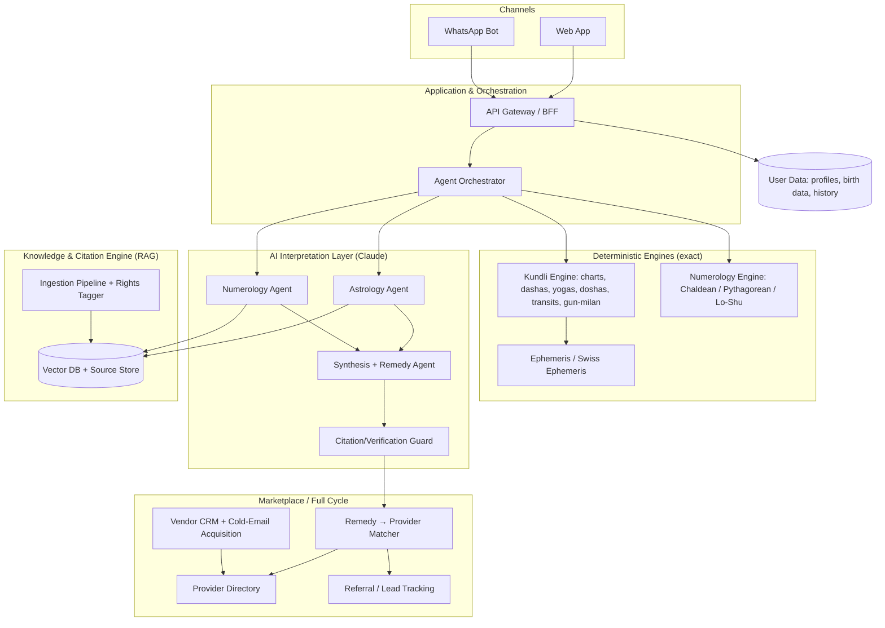

# Darpan AI — Architecture & Build Blueprint

> **Working title only — "Darpan" (दर्पण, "mirror": the platform reflects your chart back to you). Rename freely.**
>
> A spiritual-guidance platform for the Indian diaspora worldwide. It combines
> deterministic Vedic-astrology and numerology engines with an AI interpretation
> layer that **only speaks from sourced, citable knowledge**, then connects users
> to vetted real-world providers (astrologers, priests, gemstone sellers, pandits,
> remedy specialists) to close the loop.

---

## 0. The one principle everything hangs on

The headline ask was "100% accurate, no mistakes, fully referenced." Here is the
honest, buildable version of that:

| Layer | Can it be "100% accurate"? | How we guarantee trust |
|---|---|---|
| **Calculation** (kundli, dashas, numerology) | **Yes — it's astronomy + arithmetic.** | Deterministic engines using a precision ephemeris. Reproducible to the arc-second. |
| **Interpretation** (what the chart *means*) | **No — it is inherently subjective.** Respected astrologers disagree on the same chart. | The AI **never** speaks from its own "memory." Every sentence of interpretation is **retrieved from and cited to a source we control** (classical text, licensed book, or vetted expert content). No source → no claim. |

**This is the spine of the system:**

> **Deterministic engines + retrieval-grounded, citation-enforced AI. The model is forbidden from making any interpretive claim it cannot attribute to a document in our knowledge base.**

That is what makes "no mistakes" real: not that astrology becomes objective, but
that **the user can trace every statement to "per BPHS Ch. 7" or "per [licensed
author], p. 142"** — and we can stand behind it.

---

## 1. System overview



**The end-to-end user loop (MVP):**
1. User gives birth details (date, exact time, place) + full name.
2. Engines compute the **exact** kundli + numerology profile.
3. The AI agents interpret it, **every claim cited**, and explain *why*.
4. The synthesis agent proposes **remedies/solutions** (each also cited).
5. For any remedy that needs a human (a puja, a gemstone, a consultation), the
   **matcher routes the user to a vetted provider** from our directory → referral
   tracked → "full cycle" closed.

---

## 2. Core component 1 — Deterministic Calculation Engines

These are the foundation. They are **pure, testable, reproducible code** with
zero AI involvement. This is where "no mistakes" is literally true.

### 2.1 Kundli (Vedic / Jyotish) engine
- **Ephemeris:** [Swiss Ephemeris](https://www.astro.com/swisseph/) (`pyswisseph`) — the gold standard, accurate to the arc-second, derived from NASA JPL data. (Note: AGPL — we either comply with AGPL or buy the commercial license. Decision needed before launch.)
- **Zodiac:** Sidereal (Vedic), with **Lahiri / Chitrapaksha ayanamsa** as default (the Indian government standard). Support Raman & KP as options.
- **Inputs:** DOB, **exact birth time** (critical — Lagna changes every ~2 min), birth place → lat/long + **historical timezone/DST** resolution (this is a common bug source; we use a proper TZ database).
- **Outputs:**
  - 9 grahas (Navagraha: Sun…Saturn + Rahu/Ketu lunar nodes), longitudes, retrograde state, combustion.
  - **Lagna** (ascendant) + house placements (whole-sign, traditional Vedic).
  - **Nakshatra** (27 lunar mansions) + pada, for the Moon and all planets.
  - **Divisional charts (Vargas):** D1 Rashi, D9 Navamsa (marriage), D10 Dasamsa (career) for MVP; expand to Shodasavarga (16) later.
  - **Vimshottari Dasha** tree (Maha → Antar → Pratyantar periods) computed from Moon's nakshatra.
  - **Yogas** (Raj, Dhana, Gajakesari, etc.) and **Doshas** (Mangal/Manglik, Kaal Sarpa, Sade Sati) — detected by deterministic rules.
  - **Transits (Gochar):** current planetary positions vs natal — this is the **real-time** layer (recomputed on demand / daily).
  - **Gun Milan (Ashtakoota):** the 36-point marriage compatibility match between two charts.
- **Reference implementations to study/adapt:** Swiss Ephemeris, [VedAstro](https://github.com/VedAstro/VedAstro) (open-source Vedic library — excellent rules reference), Maitreya, `jyotisha` (Python).

### 2.2 Numerology engine
- Pure arithmetic, trivially exact. Support the systems Indians actually use:
  - **Chaldean** (most popular in India) and **Pythagorean**.
  - **Lo Shu grid** / Vedic "Ank Jyotish."
  - Derived numbers: **Psychic/Driver** (birth day), **Destiny/Life-Path** (full DOB), **Name number**, missing numbers, repeating numbers.
- Name analysis ties into "lucky spelling" recommendations (a common paid feature).

### 2.3 Why this matters architecturally
Because the engines are deterministic, they are **separately unit-tested against
known reference charts** and never change their answer. The AI sits *on top* and
only interprets their structured output — it never computes astrology itself
(LLMs are bad at arithmetic and would hallucinate positions).

---

## 3. Core component 2 — Knowledge & Citation Engine (the heart)

This is the most important and most labour-intensive part. It's a **RAG
(Retrieval-Augmented Generation) system with rights-tracking and mandatory
citation**. Your "reference everything" requirement lives here.

### 3.1 Source tiers (legal safety baked in)
Every document carries a **rights tag**. The retriever and the AI obey it.

| Tier | Examples | Rule |
|---|---|---|
| **T1 – Public domain** | BPHS, Saravali, Phaladeepika, Lal Kitab, classical numerology/palmistry treatises | Ingest fully, quote freely, cite freely. **Bedrock.** |
| **T2 – Licensed** | Modern authors/publishers we've signed deals with | Ingest only after license; cite by author; respect quote limits in contract. |
| **T3 – Open web** | Reputable, attributable articles | **Supplementary only.** Never the sole authority for a claim; link out. |
| **T4 – Expert-authored** | Original content from astrologers/numerologists we hire & pay | Ours to use; cite the named expert. **Highest trust, fills gaps the classics don't cover.** |

> **Hard guardrail:** the ingestion pipeline refuses to store any document without
> a rights tag and provenance (source, author, page/section, license). The AI can
> only retrieve and quote within what each tag permits. **This is how "use all
> sources" stays legal.**

### 3.2 Ingestion pipeline ("automatically updated")
```
Source (PDF/EPUB/scan/web) → OCR/parse → clean & structure →
chunk (by chapter/verse/concept) → tag (discipline, topic, rights, provenance) →
embed (vector) → store (vector DB + source-of-truth doc store) → index
```
- Runs as scheduled + on-demand jobs (this delivers the **"automatically updated"**
  property — new texts/expert content flow in continuously).
- Each chunk keeps a **stable citation handle** (`BPHS:7:12` = Brihat Parashara
  Hora Shastra, ch. 7, verse 12) so citations are precise and verifiable.

### 3.3 Retrieval + citation enforcement
- Agents retrieve top-k relevant chunks for the specific chart facts in play
  (e.g. "Mars in 7th house, Manglik"), then **must compose their answer only from
  those chunks**, attaching the citation handle to each statement.
- A dedicated **Verification Guard** (a final Claude pass + rule check) rejects any
  output sentence that lacks a backing citation, or whose citation doesn't support
  it. Failing claims are dropped or regenerated. **No uncited claim reaches the user.**

### 3.4 Tech
- **Vector DB:** pgvector (Postgres extension — keeps everything in one DB early) or a dedicated store (Qdrant/Weaviate) at scale.
- **Embeddings + reranking:** standard embedding model + a reranker for precision.
- **Source store:** the original documents + structured chunks, immutable, versioned.

---

## 4. Core component 3 — AI Interpretation Layer (how we use Claude)

A **multi-agent system** orchestrated with the **Claude Agent SDK**. Claude is the
reasoning engine; the engines and knowledge base are its tools.

### 4.1 Agents
- **Orchestrator** — receives the user's question + their computed charts, decides which specialists to invoke, manages the flow.
- **Astrology Agent** — interprets kundli facts; retrieves + cites from the KB.
- **Numerology Agent** — interprets numerology profile; retrieves + cites.
- **Synthesis & Remedy Agent** — reconciles the disciplines into one coherent narrative + concrete remedies, flags contradictions honestly, attaches the "why."
- **Verification/Citation Guard** — enforces the no-uncited-claim rule; also enforces the **disclaimer/positioning** policy (refers health/finance/legal out).

### 4.2 Claude features we lean on
- **Tool use** — agents call the kundli/numerology engines and the KB retriever as tools; Claude never does the math itself.
- **Retrieval grounding + citations** — answers are composed strictly from retrieved chunks, with source attribution returned to the UI.
- **Structured outputs (JSON)** — interpretations come back as structured objects (`claim`, `citation`, `confidence`, `topic`) so the front end can render "why" and source links cleanly, and the Guard can validate machine-readably.
- **Prompt caching** — the large system prompts + stable knowledge context are cached, cutting cost and latency dramatically (these prompts are big and reused constantly).
- **Model tiering** — Opus for deep synthesis/nuanced reports; Sonnet/Haiku for cheap, high-volume tasks (chat turns, classification, routing). Always default to the latest Claude models.
- **Eval harness** — a regression suite of reference charts + expected cited claims, reviewed by hired experts, so we catch interpretation drift when prompts/models change.

### 4.3 Honest treatment of "future-proof / real-time / fully AI"
- **Future-proof** = modular. New disciplines (palmistry, tarot, vastu) are new agents + new KB tiers; nothing else changes. New Claude models drop in behind the agent interface.
- **Real-time** = transits/dashas recompute on demand against live ephemeris; KB updates flow through ingestion continuously.
- **Fully AI** = AI does all *interpretation and routing*, but **deliberately not the math** (engines) — that's a feature, not a gap. "Fully AI for everything including arithmetic" would *reduce* accuracy.

---

## 5. Core component 4 — Marketplace / "Full Cycle"

### 5.1 Model (per your decision): vetted directory + referral first
- **Provider directory:** astrologers, pandits/priests, gemstone & rudraksha sellers, puja services, vastu consultants, remedy specialists — each with profile, specialities, languages, region, verification status, ratings.
- **Remedy → Provider matcher:** when the Synthesis Agent prescribes a remedy
  (e.g. "blue sapphire after a trial period," "Mangal Shanti puja"), the matcher
  finds the right vetted provider(s) by speciality + language + region and presents
  the hand-off.
- **Referral/lead tracking:** track the lead from recommendation → click/contact →
  conversion, for your revenue + provider reporting.

### 5.2 Vendor acquisition (your cold-email play)
- **Vendor CRM** with a **compliant cold-email** workflow: 3-months-free, no-commission
  onboarding offer.
- **Compliance built in** (non-negotiable): CAN-SPAM (US), GDPR/PECR (EU/UK),
  India **DPDP Act**, Canada CASL — verified opt-out, sender identity, suppression
  lists, consent records. We design the sequence to be legal in every diaspora market.
- **Verification gate:** providers are vetted (credentials, reviews, ID) before they
  appear to users — trust is the whole product.

### 5.3 Later phase
Add in-app booking + payments + commission once the directory has liquidity. Built
so this bolts on without re-architecting.

---

## 6. User-facing app & channels

- **Recommended start: Web app + WhatsApp.**
  - **Web** = fastest to build/iterate, shareable, great for the rich chart visuals + cited reports.
  - **WhatsApp** = dominant channel for the Indian diaspora; perfect for conversational guidance, daily transit/panchang nudges, and remedy reminders. Native mobile apps come later.
- **Pricing (your decision): freemium + subscription.**
  - Free: basic kundli + numerology snapshot (the hook).
  - Paid: deep cited reports, ongoing AI guidance, gun-milan matching, dasha forecasts, reminders.
  - Plus referral revenue from the marketplace.
- **Personalisation engine:** daily/periodic push (panchang, transit alerts, dasha
  changes, auspicious timing/muhurta) — high retention, and a natural subscription driver.

---

## 7. Data model (key entities, early)

- **User** (auth, locale, subscription tier, consent flags)
- **BirthProfile** (DOB, exact time, place→lat/long, TZ, ayanamsa pref; can hold multiple people — self, partner, family)
- **ChartComputation** (immutable snapshot of engine output for a profile; versioned by engine version)
- **Interpretation** (claim, citation_handle, confidence, topic, agent, model_version)
- **Source / Chunk** (text, discipline, topic, rights_tier, provenance, citation_handle, embedding)
- **Remedy** (description, type, citation, links to provider category)
- **Provider** (profile, specialities, languages, region, verification status, ratings)
- **Referral / Lead** (user → provider, status, attribution, revenue)
- **VendorOutreach** (cold-email sequence state, consent/opt-out, compliance log)

---

## 8. Recommended tech stack

| Concern | Choice (pragmatic) |
|---|---|
| Engines | **Python** (pyswisseph is Python-native; best ephemeris support) as a calc microservice |
| App/API | **TypeScript / Node** (or Python) BFF + REST/GraphQL |
| AI orchestration | **Claude via the Claude Agent SDK** (multi-agent, tool use, caching) |
| DB | **Postgres + pgvector** (one DB to start; split out vector store at scale) |
| Web | Next.js / React |
| WhatsApp | WhatsApp Business Cloud API |
| Infra | Containerised; start on a managed host, scale later |
| Auth/Payments | Managed auth + Stripe (global) / Razorpay (India) for the diaspora split |

Start as a **modular monolith** with clean internal boundaries (engines, KB, AI,
marketplace) — not premature microservices. Split out only what needs to scale.

---

## 9. Accuracy, trust & ethics framework

1. **Engines unit-tested** against published reference charts → math is provably correct.
2. **No uncited interpretive claim** ever reaches a user (Verification Guard).
3. **Confidence + honest disagreement:** where sources differ, the AI says so and cites both, rather than faking certainty.
4. **Expert review loop:** hired astrologers/numerologists review the eval suite and a sample of live outputs; their corrections feed back as T4 content.
5. **Positioning (your decision):** framed as **spiritual/traditional guidance with clear disclaimers** — explicitly *not* medical, financial, or legal advice; serious matters are **referred to qualified professionals**, not "decided" by the chart. This is in the Guard's policy and the UI.
6. **Privacy:** birth data is sensitive personal data. DPDP/GDPR-compliant consent, storage, deletion, and export from day one.

---

## 10. Phased roadmap

**Phase 0 — Foundations (no user-facing product yet)**
- Kundli engine + numerology engine, unit-tested against reference charts.
- KB schema + ingestion pipeline + rights tagger; ingest the first T1 public-domain texts.
- Eval harness with a handful of reference charts.

**Phase 1 — MVP (the full loop, narrow)**
- Web app: birth-data input → exact charts → **cited** AI interpretation (astrology + numerology) → remedies.
- Verification Guard + disclaimer policy live.
- Provider directory (manual seed) + remedy→provider hand-off (referral tracked).
- Freemium/subscription wired.

**Phase 2 — Reach & retention**
- WhatsApp channel; daily panchang/transit/dasha nudges & reminders.
- Gun-milan matchmaking; more vargas/yogas/doshas.
- Vendor cold-email acquisition engine (compliant) → grow the directory.

**Phase 3 — Depth & breadth**
- Licensed (T2) content deals; hire experts (T4) to fill gaps.
- Multilingual (Hindi + regional).
- Add disciplines: palmistry (computer vision on palm photos), vastu, tarot, muhurta.

**Phase 4 — Marketplace maturity**
- In-app booking + payments + commission.
- Provider analytics, ratings/trust at scale.

---

## 11. Cost & effort reality check

- **Biggest cost is not code — it's curated knowledge:** OCR/cleaning classical
  texts, licensing modern books, and paying experts to author/verify content. Budget
  real money and time here; it's the moat.
- **AI inference:** controlled via model tiering + aggressive prompt caching. The
  expensive Opus calls are reserved for deep paid reports.
- **Swiss Ephemeris licensing:** decide AGPL-compliance vs commercial license before launch.
- **Compliance:** privacy (DPDP/GDPR) + cold-email law + per-jurisdiction astrology
  consumer-protection/disclaimer rules. Worth a one-time legal review.

---

## 12. Top risks & mitigations

| Risk | Mitigation |
|---|---|
| Copyright infringement from "ingesting books" | Rights-tier pipeline; T1 public-domain bedrock; license before T2; web is supplementary only. |
| AI hallucinating astrology claims | No-uncited-claim Guard; engines do the math, not the AI; eval harness. |
| Liability from "deciding" health/money/legal | Disclaimer policy in the Guard + UI; refer serious matters to professionals. |
| Wrong birth-time/timezone → wrong chart | Robust historical TZ/DST resolution; ask users to confirm exact time; offer birth-time rectification later. |
| Cold-email legal trouble | Built-in CAN-SPAM/GDPR/DPDP/CASL compliance, opt-out, consent logging. |
| Sensitive personal (birth) data breach | Privacy-by-design, encryption, consent, deletion/export. |
| Over-scoping (all disciplines at once) | Phased roadmap; nail kundli+numerology loop first. |

---

## 13. Open questions for the next session

1. **Swiss Ephemeris licensing** — are we OK complying with AGPL, or should I budget a commercial license? (Affects how the engine service is built.)
2. **Product name & brand** — "Darpan" is just my placeholder.
3. **Repo** — this blueprint lives in the `pantrypilot` repo (an unrelated grocery tool). I recommend a **fresh dedicated repository** for this product. Want me to set that up?
4. **Ayanamsa default** — Lahiri (I've assumed this — the standard) confirmed?
5. **Expert access** — do you already know astrologers/numerologists we can hire for T4 content + the eval review loop?
6. **Target launch markets** — which diaspora countries first (US, UK, Canada, Australia, Gulf)? Affects compliance + payment rails priority.

---

*This is a blueprint, not code. Once you've reviewed it, the natural next step is
Phase 0: scaffold the calculation engines + KB schema in a dedicated repo.*
